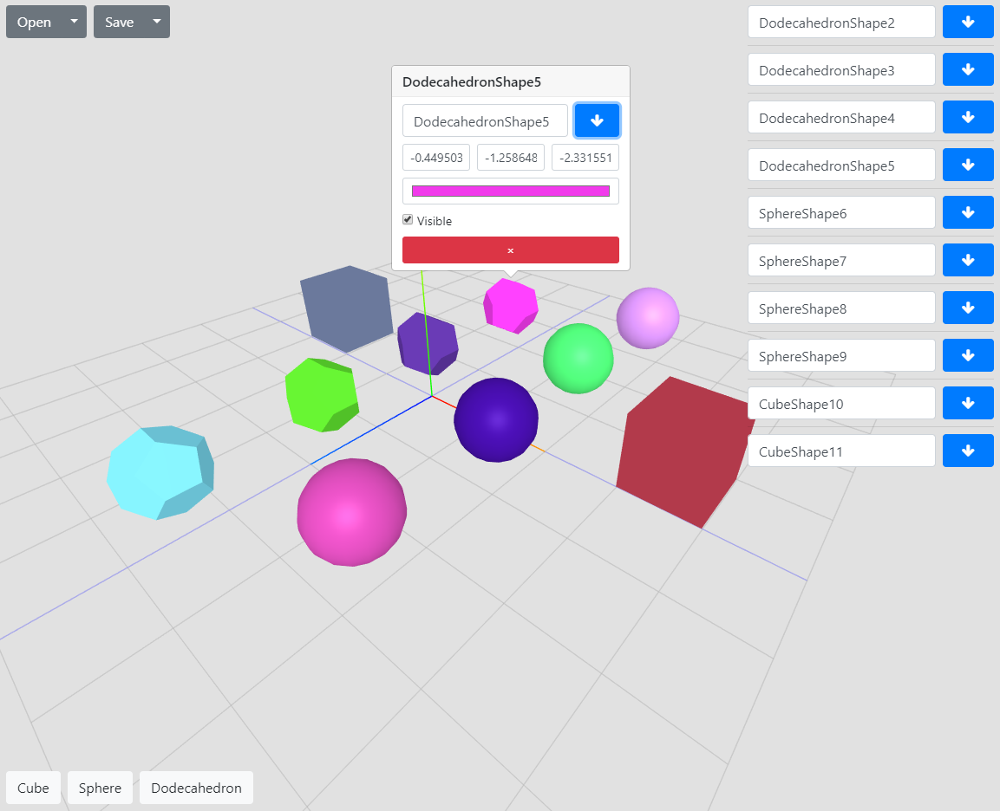

## ThreeJS example ##

[Demo link](https://abisfadon.github.io/threejs-example/dist/)  

It's demo shows a work with raycast, ui components and a list of objects in scene.
In left-bottom corner you can see a list of available 3d objects. If you want to add
a object into scene - use drag`n`drop feature. When you added a object
into scene, you also can move this object by the scene. In right-top corner you
will see the details of object what you added. The same you can see if press
a right mouse button on any object what you added to the scene. This popup
will move with you camera if you want to rotate or resize the scene. In this popup
you can change a value of parameters of the object or delete it.
In left-top corner a small menu for open/save the scene into yours local storage
or file system. Have fun! 

## Technologies and steps to setup ##
* React
* SCSS
* Webpack
* Bootstrap 4

Setup project
    
    npm i
    
Build

    npm run build

Start
    
    npm start

Demo image

